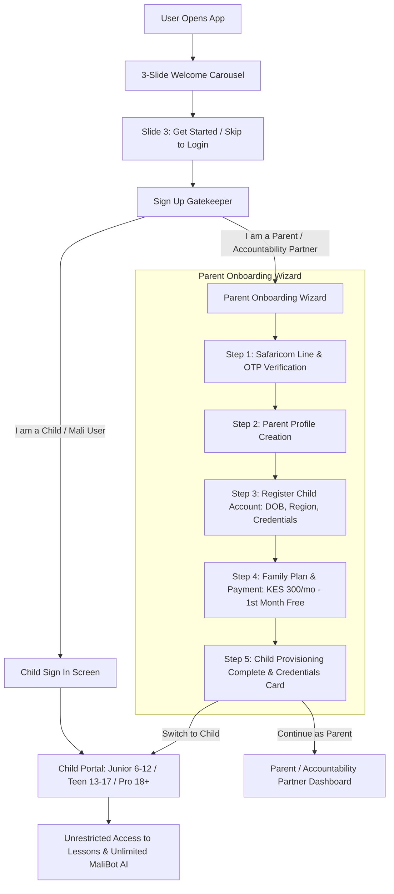

# Implementation Plan: Parent-Gated Child Provisioning, Safaricom Verification & Child Paywall Removal

Transition Mali Utajiri to a **parent-provisioned architecture** compliant with international child online safety and consumer protection standards. Children will never see paywalls, payment forms, or AI chat caps. Parents create their profile first, register their child (with DOB-based portal tier assignment), and then authorize the KES 300/month Family Plan (with the **first month 100% free**) via Safaricom line billing to complete registration and provision the child's account.

---

## User Review Required

> [!IMPORTANT]
> **Sequential Parent Onboarding Order**:
> Per your updated requirement, the parent onboarding flow will strictly follow this sequence:
> 1. **Safaricom Line & Carrier OTP Verification**: Phone verification with Safaricom branding and carrier line validation.
> 2. **Parent Profile Creation**: Parent sets their Name, Email, Password, and Relationship.
> 3. **Child Registration**: Parent registers child's Name, Date of Birth (with instant age calculation & portal tier assignment: Junior 6–12, Teen 13–17, Pro 18+), Region (Kenyan vs. International), and sets the child's login username/email & password.
> 4. **Family Plan & Payment Authorization (KES 300/mo - 1st Month Free)**: Parent reviews the family plan terms (KES 0.00 today for Month 1, KES 300/mo auto-renewal via Safaricom carrier billing) and authorizes the payment to complete child registration and account provisioning.
> 5. **Child Provisioning Complete & Credentials Card**: Generates the child's login card with options to "Log In as Child Now" or "Go to Parent Dashboard".

> [!IMPORTANT]
> **Complete Child Paywall Removal**:
> - The 5-prompt limit on MaliBot AI in [ChatView.tsx](file:///c:/Users/kiruj/UTAJIRI/Finance/src/pages/ChatView.tsx), [MaliBot.tsx](file:///c:/Users/kiruj/UTAJIRI/Finance/src/components/MaliBot.tsx), and [App.tsx](file:///c:/Users/kiruj/UTAJIRI/Finance/src/App.tsx) will be completely removed.
> - All child-facing `PaymentModal` triggers, upgrade badges, and lock indicators will be eliminated.
> - If a family subscription expires, children see a gentle informational screen directing them to their parent, with zero payment forms or inputs exposed to the child.

---

## Proposed Architecture & User Flows

---

## Proposed Changes

### 1. Welcome Carousel Integration

#### [NEW/VERIFIED] [WelcomeCarousel.tsx](file:///c:/Users/kiruj/UTAJIRI/Finance/src/components/onboarding/WelcomeCarousel.tsx)
- The 3-slide animated welcome carousel is already built with:
  - **Slide 1**: Welcome to Mali Utajiri (*"Smart money habits beat pocket money regrets!"*) + sunburst crest graphic.
  - **Slide 2**: Financial Education & Pedagogy (*Wealth jars, market simulators, order flows, MaliBot AI*).
  - **Slide 3**: Journey to financial freedom with **"Start Your Journey • Get Started"** and **"Already have an account? Log In"**.
- Ensure state persistence in `Auth.tsx` so returning users or users who click "Log In" skip directly to the login screen.

---

### 2. Sign In & Sign Up Overhaul

#### [MODIFY] [Auth.tsx](file:///c:/Users/kiruj/UTAJIRI/Finance/src/components/Auth.tsx)
- Overhaul `Auth.tsx` into a multi-step guided experience:
  - **Gatekeeper View (`role_select`)**:
    - Clear choice cards:
      - **"I am a Parent / Accountability Partner"** (Subtext: *Set up family plan, verify Safaricom line, and provision child accounts*).
      - **"I am a Child / Mali User"** (Subtext: *Log in using credentials provided by your parent*).
    - Footer option: *"Already have an account? Log In"*.
  - **Child Gate Enforcement**:
    - If a child attempts to register directly, display a supportive notice: *"Child accounts must be provisioned by a parent or guardian to ensure safety and compliance. Ask your parent to sign up!"* with a button to switch to Parent sign-up.
  - **Parent Onboarding Wizard (`parent_signup`)**:
    - **Step 1: Safaricom Line & Carrier Verification**:
      - Input for Kenyan mobile number (+254 7XX / 07XX / 01XX).
      - Safaricom branding badge and carrier prefix auto-detection.
      - Simulated OTP verification (6-digit code with auto-fill option and timer).
    - **Step 2: Parent Profile**:
      - Full Name, Email, Password, Confirm Password, and Relationship (Mother, Father, Guardian, Mentor).
    - **Step 3: Child Account Registration**:
      - Child Full Name.
      - Date of Birth (DOB) with live age calculation and automatic portal tier badge (`Junior` 6–12, `Teen` 13–17, `Pro` 18+).
      - Region selector (🇰🇪 Kenya vs. 🌍 International).
      - Child login credentials: Child username/email and child password.
    - **Step 4: Family Plan & Payment Authorization (KES 300 / Month - Month 1 100% Free)**:
      - Prominent Family Plan summary: KES 300/month.
      - **Month 1: KES 0.00 (100% Free)**.
      - Auto-renewal notice: Billed automatically to Safaricom phone line `+254 7XX...` after 30 days.
      - One-click Safaricom Line billing authorization & payment confirmation button.
    - **Step 5: Child Provisioning Complete & Hand-off Card**:
      - Success celebration animation.
      - Child credentials card (Child Name, Assigned Portal, Login Email/Username, Password).
      - Action buttons: **"Log In as [Child Name] Now"** or **"Go to Parent Dashboard"**.

---

### 3. Server API for Child Account Provisioning

#### [MODIFY] [server.ts](file:///c:/Users/kiruj/UTAJIRI/Finance/server.ts)
- Add `/api/parent/provision-family` endpoint:
  - Handles parent profile registration and verified Safaricom phone number.
  - Creates the child user with `supabaseServiceRole.auth.admin.createUser` (or creates profile with `parent_id`, `tier`, `country`, `dob`, `chatbot_paid: true`, `subscription_status: 'active_trial'`).
  - Initializes child wallet and default wealth jars (Spend, Save, Invest, Give).
  - Provides mock/offline fallback for seamless local development if service role keys are absent.
  - Returns created parent session and child account details.

---

### 4. Complete Paywall Removal for Children

#### [MODIFY] [ChatView.tsx](file:///c:/Users/kiruj/UTAJIRI/Finance/src/pages/ChatView.tsx)
- Remove `isLocked` state calculation.
- Remove the 5-prompt message cap check and paywall banner.
- Remove `PaymentModal` import and child-facing payment triggers.
- Keep textarea and send button permanently active for children.

#### [MODIFY] [MaliBot.tsx](file:///c:/Users/kiruj/UTAJIRI/Finance/src/components/MaliBot.tsx)
- Remove `isLocked` calculation and 5-message limit query.
- Remove upgrade banner and paywall buttons.
- MaliBot AI is 100% free and unlimited.

#### [MODIFY] [DashboardView.tsx](file:///c:/Users/kiruj/UTAJIRI/Finance/src/pages/DashboardView.tsx) & [App.tsx](file:///c:/Users/kiruj/UTAJIRI/Finance/src/App.tsx)
- Remove `onUpgradeClick` prop and payment modal references.
- Remove client-side 5-prompt block from `handleSendMessage`.
- Add gentle subscription paused state: If parent subscription is expired after the 30-day free trial, show an age-appropriate screen: *"Your family plan is paused. Ask your parent to renew in their Parent Dashboard"*, without any payment forms or buttons exposed to the child.

---

### 5. Parent Dashboard: Child Management & Subscription Status

#### [MODIFY] [ParentDashboard.tsx](file:///c:/Users/kiruj/UTAJIRI/Finance/src/pages/ParentDashboard.tsx)
- Add **"+ Add Child"** button in the header next to the child switcher.
- Add an interactive modal allowing parents to provision additional children at any time:
  - Child Full Name
  - DOB (with live Portal Tier calculation)
  - Region (Kenya vs International)
  - Child Login Credentials
- Add a **Family Plan & Safaricom Billing Card**:
  - Displays linked Safaricom billing phone number.
  - Status: *"Month 1 Free Trial Active (Renews on [Date] for KES 300/mo)"*.
  - Option to update billing line or trigger renewal.

---

## Verification Plan

### Automated Build & Typecheck
- Run `npm run build` or `npx tsc --noEmit` to verify type safety and bundle generation.

### Manual & Visual Verification
1. **Welcome Carousel**:
   - Inspect Slide 1 (motto + crest), Slide 2 (pedagogy & modules), Slide 3 (journey + "Get Started").
   - Click "Already have an account? Log In" -> goes directly to login.
2. **Sign In & Sign Up Gatekeeper**:
   - Click "Get Started" -> Role Selector shows Parent vs. Child options.
   - Select Child -> verify direct redirect to login (no child sign up).
   - Select Parent -> opens 5-step wizard.
3. **Parent Onboarding Flow (Strict Sequence)**:
   - **Step 1**: Enter Safaricom phone (+254 712 345678), verify Safaricom badge, enter OTP code.
   - **Step 2**: Enter parent details (Name, Email, Password, Relationship).
   - **Step 3**: Enter child details:
     - Enter DOB for a 10-year-old -> confirms `Junior` portal badge.
     - Select Kenya region.
     - Set child username and password.
   - **Step 4**: Review Family Plan (KES 300/mo, 1st month free, KES 0.00 today). Authorize via Safaricom billing line.
   - **Step 5**: View Child Provisioning Complete card with credentials.
4. **Child Login & Uncapped AI Verification**:
   - Log in using the child credentials.
   - Verify assigned Junior portal theme loads.
   - Send 6+ messages to MaliBot in both Dashboard and ChatView -> confirm zero locks, zero paywall prompts, and smooth AI responses.
5. **Parent Dashboard Child Management**:
   - Log in as parent -> verify "+ Add Child" modal works and Family Plan Safaricom billing card is visible.
